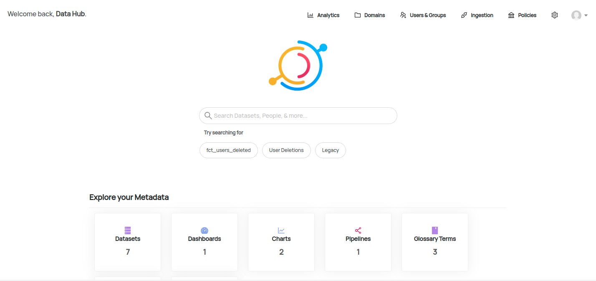

# DataHub docker-compose

Getting started with LinkedIn's [DataHub project](https://github.com/datahub-project/datahub) on a all-in-one compose configuration



## Running DataHub

Raise your host's ulimits for ElasticSearch to handle high I/O :

```bash
# Persist this setting in `/etc/sysctl.conf` and execute `sysctl -p`
sudo sysctl -w vm.max_map_count=512000
```

Run the whole DataHub cluster :

```bash
# Edit env variables with desired credentials
cp .env.example .env

docker-compose up -d
```

Now, wait a bit for magic to happen !

Access DataHub on port 9002 with default username AND password `datahub`

## Ingesting a dataset with metadata

Start injecting [`bootstrap_mce.json`](./metadata-ingestion/bootstrap_mce.json) by running :

```bash
docker-compose -f ingest.docker-compose.yml run ingestion
```
